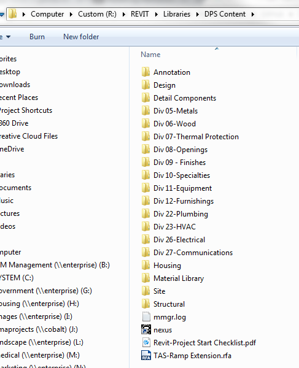

## Revit Content

To ensure that **all** projects are utilize similar content, DPS has a content directory located on the R drive for all offices.

This content library is organized in a familiar fashion. **Master Format** is the logic utilized in this process.

* **Annotation** a library of typical NCS compliant annotation used in Revit.
* **Design** any rendering content such as entourage or signage.
* **Detail Components** 2D components used for detailing (organized using Master Format as well).
* **Division Content** model content organized by respective Master Format division.

>If needed Revit support will also model geometry based off of existing conditions or CAD files. Please ebsure that your CAD files are ready to be handed off by verifying the precision is accurate and the floor to floor height is indicated. (*there have been instances where Revit support has received "design drawings" that were not ready to be modeled*)

The project start sheet is located in: R:\REVIT\Libraries\DPS Content\Revit-Project Start Checklist.pdf 

*Examples of the project start sheet are found below.*

