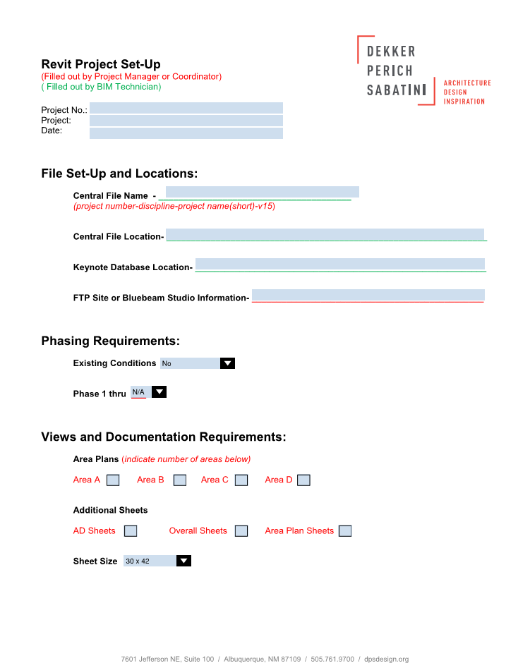
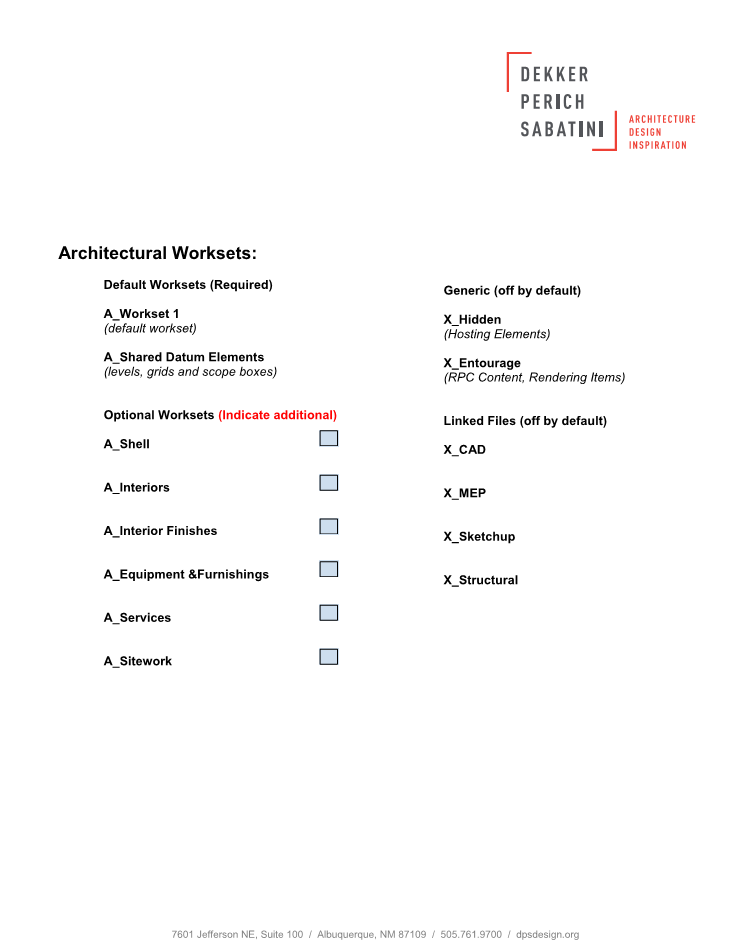

## Project Start Process

To ensure that **all** projects are started in the most efficient manner, DPS has implemented a process that requires a Revit Support tech or Design Technology Leader to start your project for you.

After a project coordinator or project manager has completed the **Project Start Form** or **BIMxp** the Revit Support tech will:

* **Start** a fresh Revit file with the latest version of the template.
* **Create** all applicable worksets needed for project scope.
* **Apply** project phasing and **create** corresponding views.
* **Save** the new file to your project directory as a Revit central file.

>If needed Revit support will also model geometry based off of existing conditions or CAD files. Please ebsure that your CAD files are ready to be handed off by verifying the precision is accurate and the floor to floor height is indicated. (*there have been instances where Revit support has received "design drawings" that were not ready to be modeled*)

###The reason this is of **utmost** importance is, the DPS Revit template contains numerous settings. Having a standard start process, ensures these settings are in tact and the project team will be successful.

The project start sheet is located in: R:\REVIT\Libraries\DPS Content\Revit-Project Start Checklist.pdf 

*Examples of the project start sheet are found below.*

