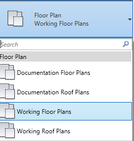
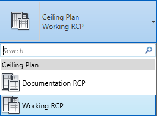

## View Types in Revit Template

There are a number of view types already built into the DPS template. This section aims to inform you on the types available.
> All views share a common organization through the use of working and documentation style views.

---

## Floor Plan View Types 

 Messy Views| Sheet Views | In-Revit View
---|---|---
-Working Floor Plans   -Working Roof Plans |-Documentation Floor Plans   -Documentation Roof Plans|

---

## Ceiling Plan View Types 

 Messy Views| Sheet Views | In-Revit View
---|---|---
-Working Ceiling Plans|-Documentation Ceiling Plans|

---

###If you have any questions at all, <a href ="/01_Introduction/1-2_revitsupport.md"> Revit Support </a> will be more than happy to assist.

