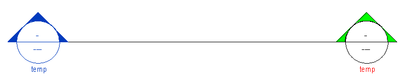

## View Types in Revit Template

There are a number of view types already built into the DPS template. This section aims to inform you on the types available.
> All views share a common organization through the use of working and documentation style views.

---

## Floor Plan View Types 

 Messy Views| Sheet Views | In-Revit View
---|---|---
-Working Floor Plans  -Working Roof Plans |-Documentation Floor Plans  -Documentation Roof Plans|

---

## Ceiling Plan View Types 

 Messy Views| Sheet Views | In-Revit View
---|---|---
-Working Ceiling Plans|-Documentation Ceiling Plans|

---

## Section / Detail View Types 

 View Type| Description | In-Revit View
---|---|---
-301 Building Sections  -320 Wall Sections  -360 Casework Sections  -680 Window Types  -Drafting View Reference  -Working Sections|-Used for Building Section Views   -Used for Wall Section Views  -Used for Interiors' Casework  -Used for Window Types  -Reference non-live views  - Working Sections for study |

##In addition to the section views that exist, there are a few rules of thumb.

>Window Type sections are meant to be used for live window and frame elevations. They are only visible in working views and look like this. (These views should also be pinned) 
The reason this view type is useful is because it already has a view template assigned to make your window elevations look great. Especially if you utilize the DPS model group method, covered at a later module.

*An example of this is located below.*

>Working Sections are meant to be used as references. These section types are very useful for studies and are very non-commital. The idea is, they are used, then removed when done. 

---

###If you have any questions at all, <a href ="/01_Introduction/1-2_revitsupport.md"> Revit Support </a> will be more than happy to assist.

