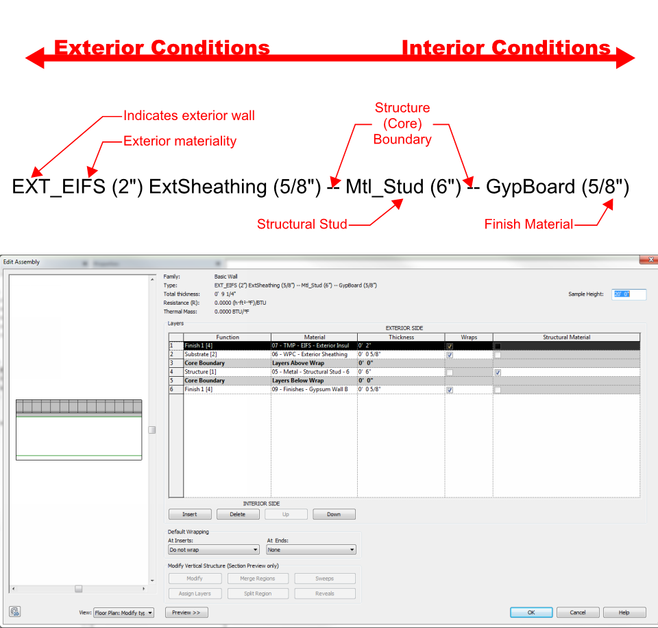
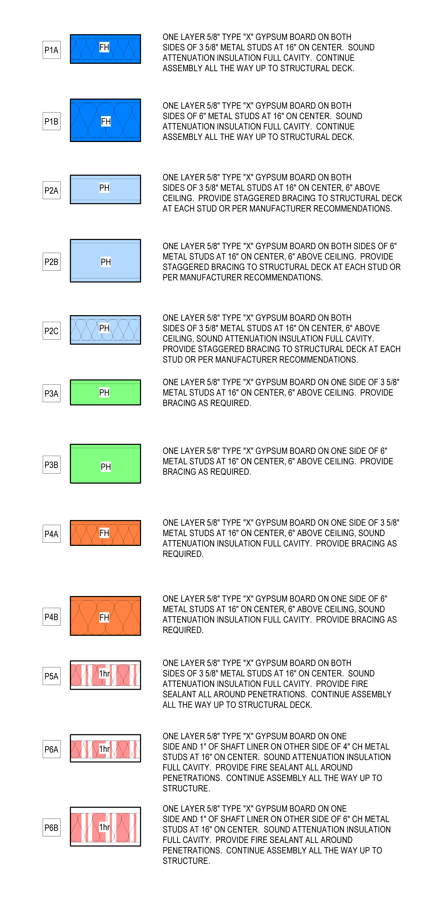
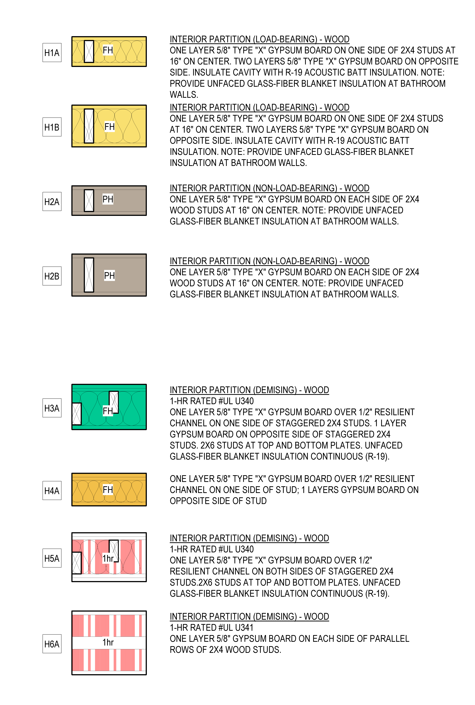
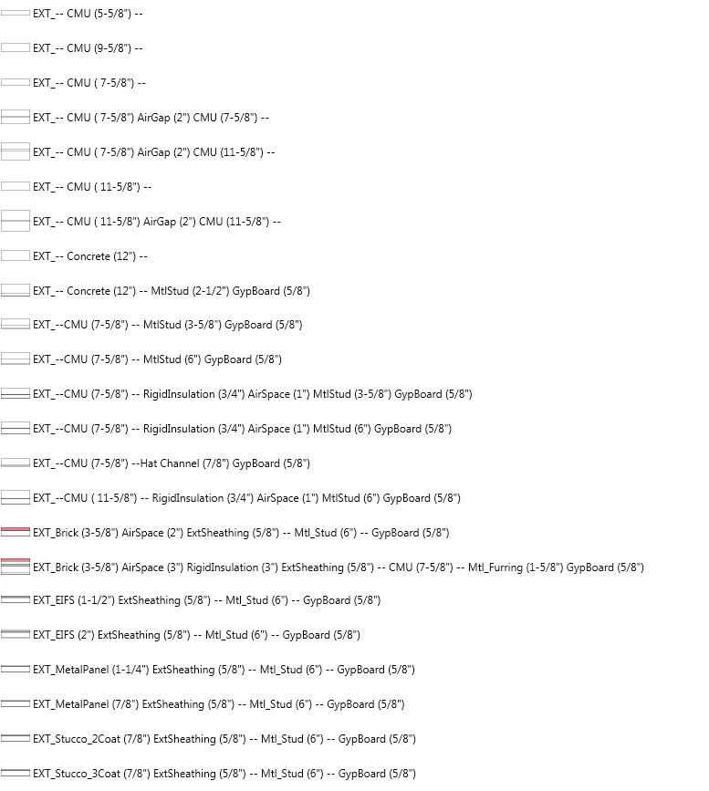
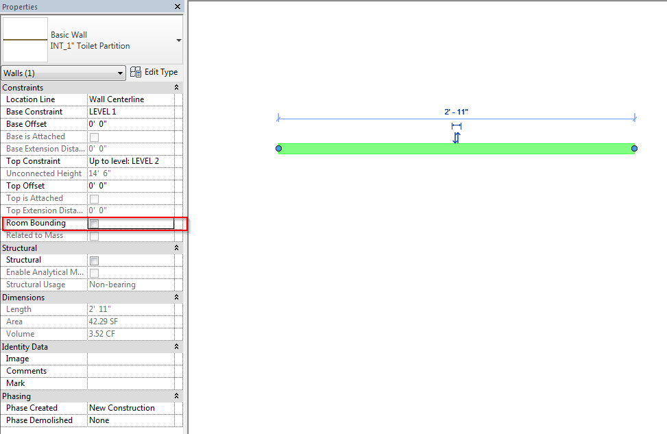
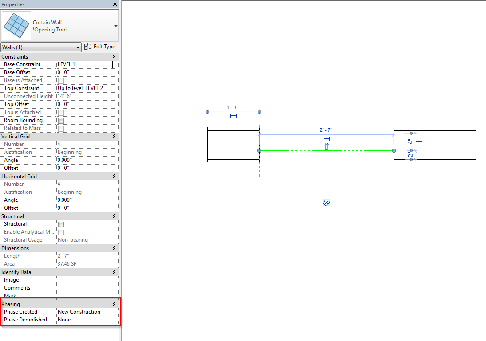

# Wall Types in Revit Template

There are a number of wall types already built into the DPS template. This section aims to inform you on the types available.
> The wall types loaded in the DPS Revit template are meant as a baseline, to get you started on your project. Wall types include typical partitions for commercial and housing.

---

## First things first. Demystify the Naming Convention
> This naming convention was implemented to allow the wall type to make sense in regards to the specific assembly.

---

## Metal Stud Partition Types
> Although these are titled "commercial", they apply to several project types including Educational facilities.

---

## Wood Partition Types
 > These partition types were generated out of the necessity of including wood partitions in the template. They are also meant as a baseline to get you started in your Revit project. The naming is also a placeholder, so please do not get hung up on this factor.

 

---

## Exterior Wall Types
 > Within the DPS Revit template are a selection of exterior wall types that you are able to utilize on your project. These wall types are in the template to either use or at the very least demonstrate the naming convention adopted at DPS.

 

---

## Other Wall Types
 > Walls in Revit are extremely powerful and allow for more use than just as walls. Below we will illustrate some of the use cases.

### Below we have the Toilet partition that DPS utilizes.

 

 The reason we use a wall rather than a Revit component is, because of the ease of use. Rather than having to edit a complicated family, the user can simply adjust the wall. *Remember to change these walls to non room bounding in your project files. Otherwise each toilet stall would be a room, whic isn't fun.*

---

 ### Another useful tool that is available for use is, the Opening Tool.

 

 This tool is simply a curtain wall that is empty of any panels. This enables us to use an opening tool that actually works in Revit. *See below for a comparison of this tool versus the wall opening in Revit*

 Feature | OOTB* Opening Tool | !Opening Tool
 ------------------|----------------
 Phase-able? | No | Yes
 Selectable Via Filter | No | Yes
 Schedule-able | No | Yes
 Breaks Often | Yes | No
 Awesome User-Submitted Idea? | No | Yes (Carlos from Commercial)

 *Indicates Out Of The Box

---

### If you have any questions at all, <a href ="/01_Introduction/1-2_revitsupport.md"> Revit Support </a> will be more than happy to assist.
