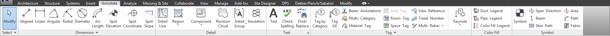
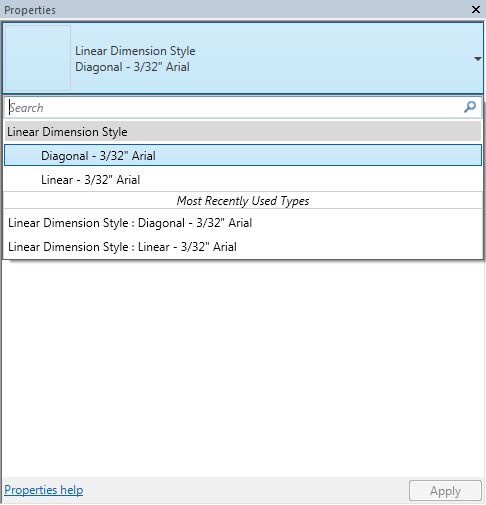

# Annotation Types in Revit Template
  
## Welcome to the annotation tab!
 

 
We're going to be going over some of the DPS best practices for annotating your model in terms of the type of annotation to be using. For the majority of the text we deal with is 3/32" in height. The reason we use this is due to the NCS (National CAD Standards) a standard that drawings should follow. All of our best practices are pre-loaded into the Revit template for your convience and for efficiency. 

### Dimensions
  
In the dimension panel you'll find an assortment of tools to use, the most popular tool is of course, is the *aligned dimension*. The aligned dimension is the most commonly used annotiona tool we use today, there's even a button for it on the top panel in Revit. 
 There are a couple of different types loaded into the aligned dimension tool, the standard is our Diagonal 3/32" Arial (See below).
 

###To do:

- [x] create placeholder page for content
- [ ] generate thumbnails for typical annotation
- [ ] create write up for each annotation
- [ ] discuss NCS and how it relates
