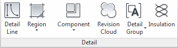

# Annotation Types in Revit Template
  
## Welcome to the annotation tab!
 

 
We're going to be going over some of the DPS best practices for annotating your model in terms of the type of annotation to be using. For the majority of the text we deal with is 3/32" in height. The reason we use this is due to the NCS (National CAD Standards) a standard that drawings should follow. All of our best practices are pre-loaded into the Revit template for your convience and for efficiency. 

### Dimensions
In the dimension panel you'll find an assortment of tools to use, the most popular tool is of course, is the *aligned dimension*. The aligned dimension is the most commonly used annotiona tool we use today, there's even a button for it on the top panel in Revit. 
 There are a couple of different types loaded into the aligned dimension tool, the standard is our Diagonal 3/32" Arial (See below).
 
 
Along with the aligned dimension there are a slew of other tools to use, all of which have the same standard in terms of size and text type. One thing to note, our precision with dimensions and other items that use distance we use a 1/256" precision, this ensures us that we are modeling accurately. 

### Lines, Filled Regions, Components, etc...
These are all found under the *detail panel* we seldom use lines in actual plans, but there are small instances where they can be used. Same goes for filled regions and detail components. The one place you will find these commonly used are in our section details, i.e. drafting views or non live views, no they're not actually dead theres just no 3D revit elements shown in the views. Not everything we do in Revit is live, and because of that we use the detail tools the most. 
 

 
We have a vast library full of almost every detail component you may need, however, there are plenty of instances where the component you need is not in our library, what do you do when that happens? We would like for you to email 

###To do:

- [x] create placeholder page for content
- [ ] generate thumbnails for typical annotation
- [ ] create write up for each annotation
- [ ] discuss NCS and how it relates
