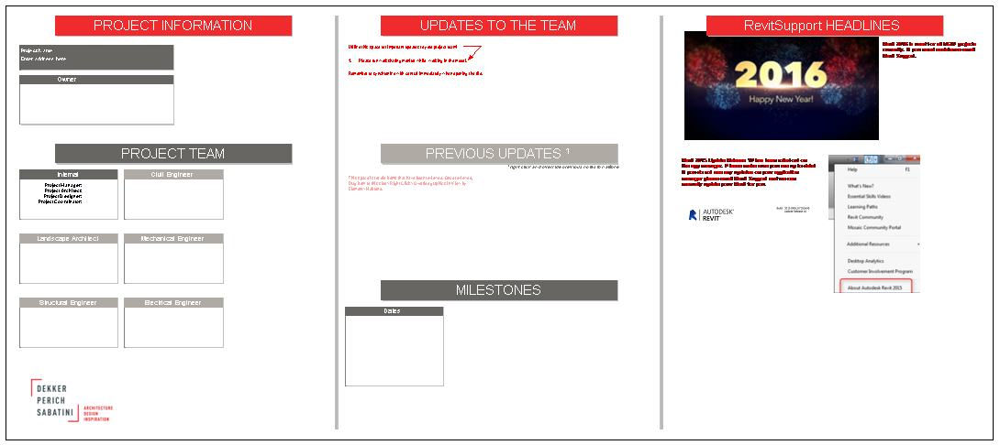

# DPS Revit template

#### The current Revit template for DPS is **Architecture-2016.rte**

 >Currently Autodesk releases Revit on a yearly cycle in the spring. Shortly after this release Revit Support will test the new release and research changes within the Revit UI. This is generally a process of a few months. During or after this process, the Design Technology Leaders will select a "pilot project" to ensure the new release is stable.

 After this selection process has happened the current release's template will be the only one that gets updated.

As of this edition of this primer, the version is Revit 2017.

---
