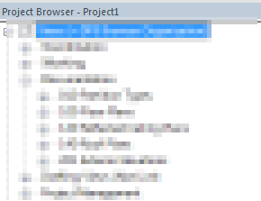

## View Organization

### Why is view organization important?

The reason view organization is important is to keep track of what is going on in our Revit model. This all relates back to file management. If we have a **standard** view organization, this supports **consistent** workflows for all project team members.

>If you fail to organize your views it begins to feel like this rather quickly.

>

>This then results in users duplicating work and the model being less efficient than we would like.

###### This next section will cover the logic around DPS' view management system.
