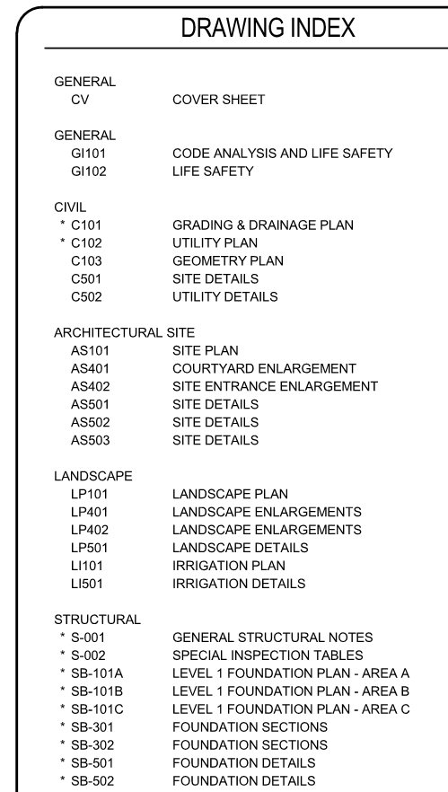

## Sheet Organization

### Why is sheet organization important?

Organizing out sheets in Revit enables us to have an accurate representation of the project phases. This also ensures that our **drawing index** will appear correctly on our cover sheet.

We can consider our **drawing index** somewhat of a roadmap to our documents.

>See below for a great example of a well organized **Drawing Index**

>

###### This next section will cover the logic around DPS' sheet management system.
