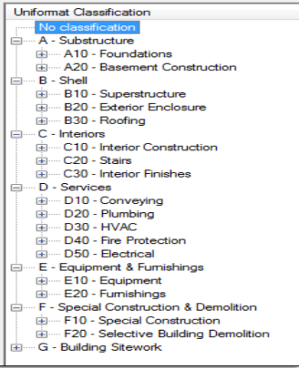

## DPS Worksets Best Practices

DPS has adopted a methodology for worksets that utilizes **UniFormat** to logically name worksets. The portion that applies is specifically the **Top Level** of UniFormat, with a discipline designator as a prefix.

**Naming and Organization System** 
* Based on Top Level of Uniformat
* Prefixed with a Discipline Designator
 * A Architectural
 * M Mechanical
 * E Electrical
 * P Plumbing
 * S Structural
>Example: **A_Shell**
 
 
 
 
 
 
 
 

##Standard Worksets
Default Worksets (required)| Generic (off by default)
---------------------------|-------------------------
