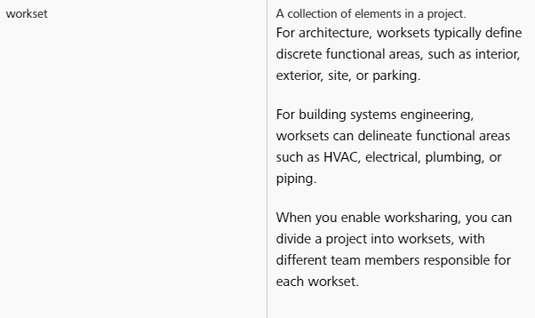

## Worksets Best Practice

### What are worksets?

Autodesk's definition of worksets is as follows. 
>

We can consider our **drawing index** somewhat of a roadmap to our documents.

>See below for a great example of a well organized **Drawing Index**

>

###### This next section will cover the logic around DPS' sheet management system.
