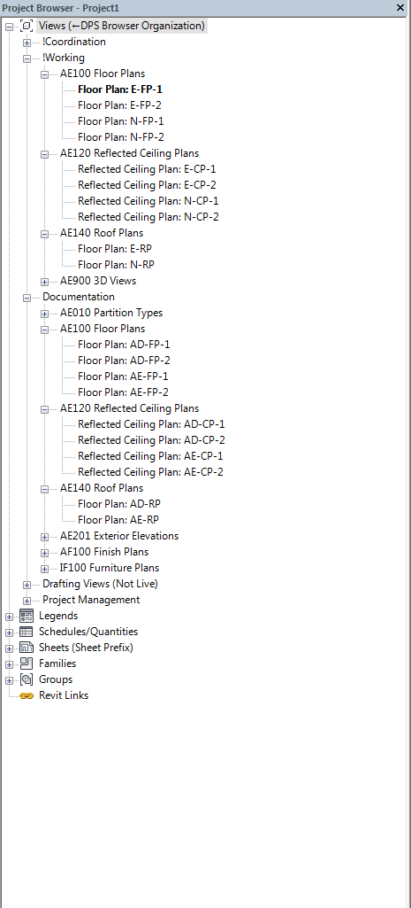

# Phasing Overview

Phasing represents the distinct time period for the life a project, there are two parameters in Revit just for phasing views. Phase and Phase Filter, both of which are editable in the properties box of the view or are accesible in a view template. For phasing of an existing and new construction we typically will have an AD-FP view for demolition, AE-FP for new constuction elements, E-FP for existing elements in the working view, N-FP for new elements in the working view. We will be going through what each specific phase and phase filter does to your view(s).
 
 
 
 
Phasing can also be applied to Revit Elements to be shown as either existing, new construction or demolished which are handled by both the phase created/phase parameters which we will be going into later. 
