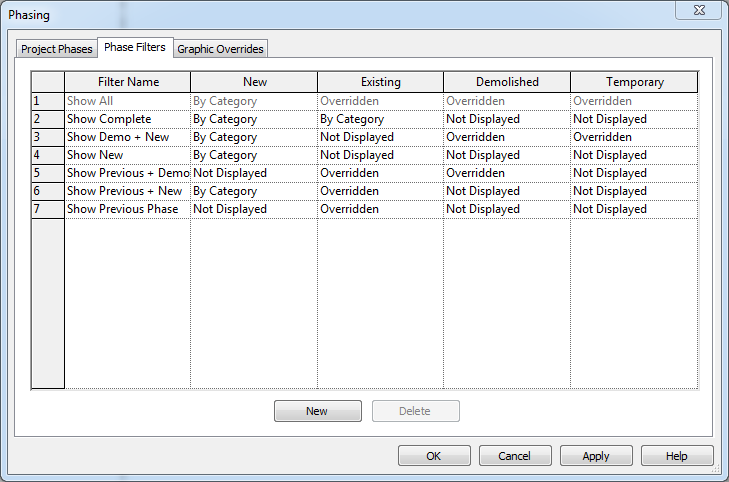

# Phase Filters
 
 
There are eight different phase filters that all do something specific which control the display of elements based on their phase created status. You can change how each of the phase filters display in the views they are assigned as well as adding or removing additional filters.  

 
* None - Does not apply a phase filter to the view. The view displays all elements from all phases.
* Show All - Shows new elements (using the graphics settings defined for that category of elements) and existing, demolished, and temporary elements (using the Graphic Overrides settings for each phase defined using Manage tab > Phasing panel > Phases > Graphic Overrides tab).
* Show Complete - Shows the completed project, after demolition and new work have been performed in the current phase.
* Show Demo + New - Shows demolished elements and all new elements added to the building model.
* Show New - Shows all new elements added to the building model.
* Show Previous + Demo - Shows existing elements and demolished elements.
* Show Previous + New - Show Previous Phase - Shows all elements FROM the previous phase. In the first phase of a project, existing elements are new to that phase, so applying the Show Previous Phase filter causes no elements to be DISPLAYED.
* Show Previous Phase - Shows all elements room the previous phase. In the first phase of a project, existing elements are new to that phase, so applying the Show Previous Phase filter causes no elements to be displayed. 

###To do:

- [x] create placeholder page for content
- [ ] add DPS typical view naming strategies
- [ ] discuss phase filters needed
- [ ] view templates
