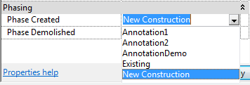
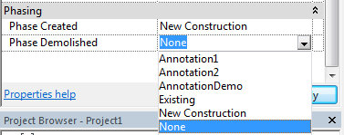
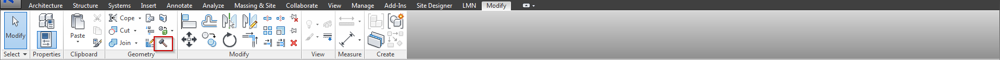

# Element Phasing
 
 
Almost every element in Revit is phaseable, openings, grids, annotation are not however. Those that are will have the parameters Phase Created and Phase Demolished. Phase Created is well, when the element is built or when it was built, Phase Demolished is when the element will be removed if at all it will be removed.  
 
In the DPS Template you will see multiple phases, for Revit elements you'll only need to be concerned with Existing and New construciton as to what you assign each element. The other phases can be explained <a href="/06_Phasing/6-3_annotationphasing.md">here.</a>
 

 
 
You'll see similar items for the Phase Demolished parameter plus an additional choice. 
 

 
As a time saver, always remember what view you are drawing elements in, be aware of what the Phase of the view is set too to eliminate confusion. If you need to model and existing element, be sure to model in the E-FP views or anything whose Phase is set to Existing. If you draw in the E-FP view elements will already take on the existing phase where as in the N-FP view elements will take on the New Construction phase. 
 
 
 
There is an another method to demolish Revit elements. It is called "Demolish" it looks like a hammer (See below) if the user likes to use a tool rather editing the properties of the selected element(s). 
 

