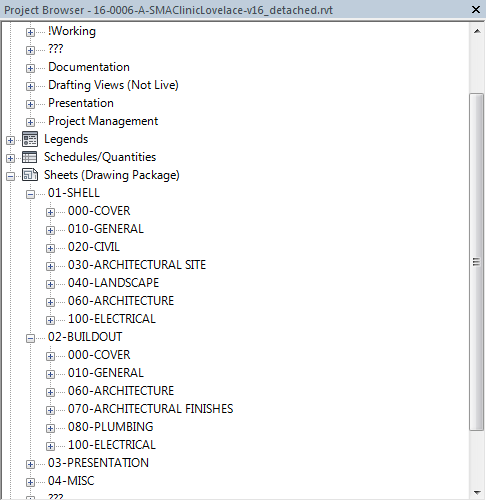
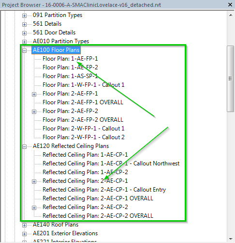

 
#Construction Phasing 
 
Alright, so we have some different submittals for a project such as shell, and buildout. How will this look in our Revit model? Once Revit Suport sets up your file for you with construction phasing, you'll see something like this in your project browser. 
 

  
When you expand each folder you'll see something you are very familiar with and it's our break down of the disciplines. 
 

 
Now, you'll also see something new with your views, we will insert a "1" for example, and this is basically to indicate what buildout it belongs too. You'll need to let us know how many construction phases you plan on having and we can adjust accordingly to accomidate your projects needs.  
 
1 - For Shell
2 - For Buildout
 

 
Now, lets say you have consultants 
