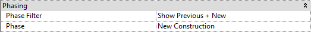
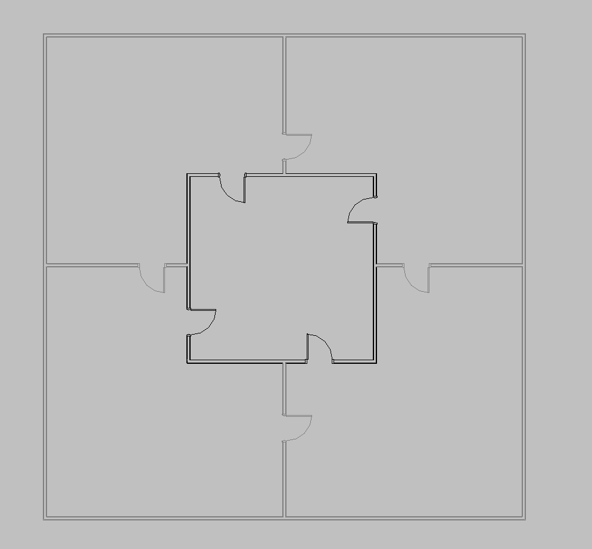
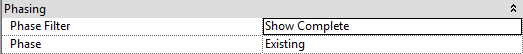
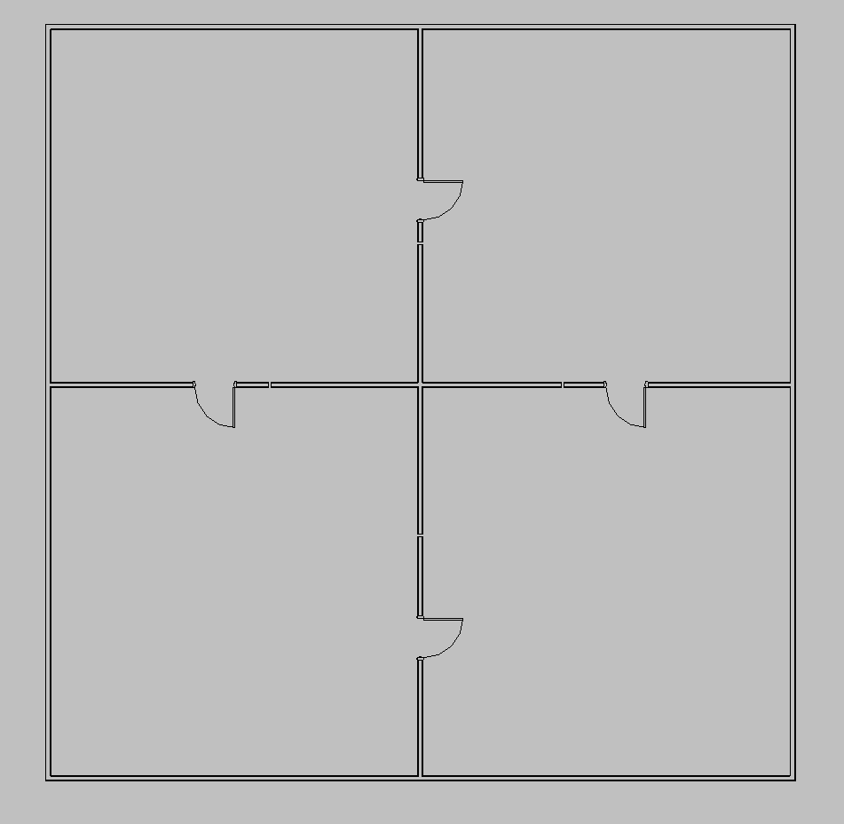
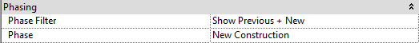
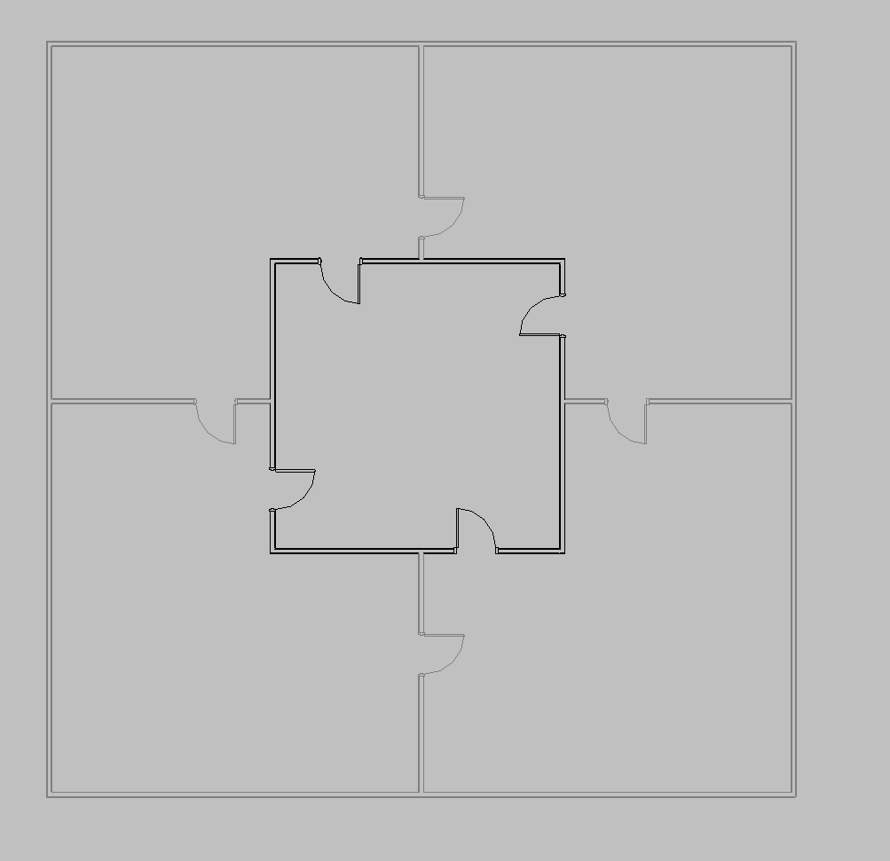
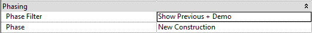
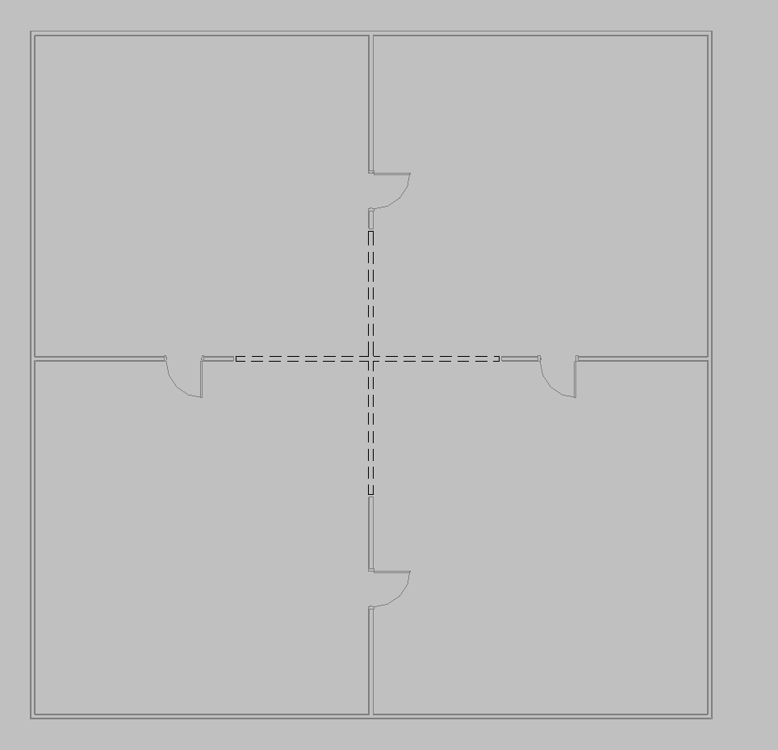

#DPS Phasing Stanard
 
As discussed in the phasing overview, we have a naming standard for our views when phasing is applied with new construction and existing conditions. Revit Support will set up phasing of a project for you, you will be able to notify us in the <a href="/02_DPS Revit Template/2-1_project_start.md">Project Start</a> pdf. 
Below you will see what each view will look like in your project and what phase filter and phase is applied to each view. 
1.N-FP
 

 

 
2.E-FP
 

 

 
3.AE-FP
 

 

 
4.AD-FP
 

 

