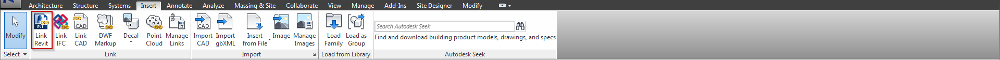

#Linking Revit Models 
 
So now that you have downloaded your consultants model(s) you'll need to link them into your project. It's very simple to do, you just need to go to the insert tab and select "Link Revit" and navigate to where you saved it and click open. Now one of your best practices is when you have your project set up originally you'll have worksets made for those specific worksets, the reason we do this is so we can hide our links easily with our view templates. It also helps too if we want to open up a detached file of the project in a later release of revit because it temporarily upgrades everything and we can choose not to open those worksets so they dont upgrade, which could take a very long time to do in some instances. 

  
#Managing Linked Models
 
Now you have your model linked into your project, and your consultant sends you an updated model, what do you do now? There are a couple of methods, all accomplish the same so there is really no right way to do it. 
 
1. You can go into the link tab in revit and select manage links under the Revit tab select the link and click reload in the bottom left corner. (See below) 
 

 

2. You can reload a link from you project browser by simply right clicking on the link and selecting either "Reload from..." or "Reload" (See below)
 

