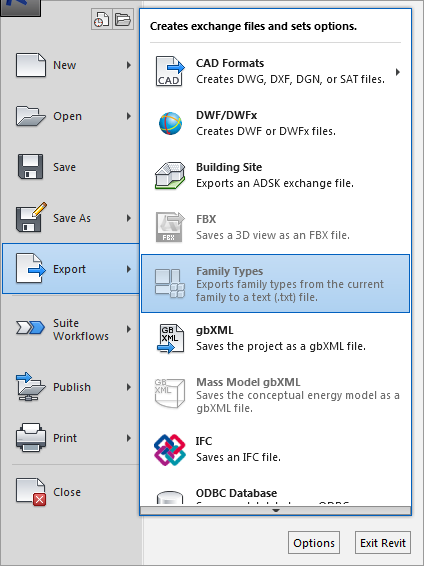

#Exporting Revit 
 
Alright! So you've met with your consultants and found out that your MEP consultant will be working in CAD while you are working in Revit. You now need to export them a CAD plan for them to work off of. How do you do this? Or you're at a point with the model that you need to create a rendering in Lumion, what do you do? There are several methods for exporting we will be going through the best ways and what are the best formats to export Revit to various platforms. 

