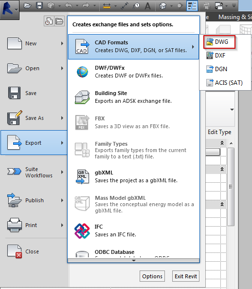
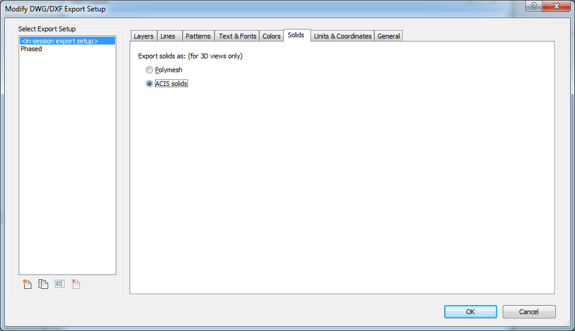

#Exporting to DWG (CAD)
 
##Exporting out 2D
There is really only one method of exporting to CAD format, it's relatively simple to do. You'll need to know what version of CAD your consultant is working in, this way they won't have to go through the trouble of updrading or downgrading the file. Once you know what version of CAD they are running you can now begin to export. You can click on file-export-CAD Formats-DWG (See Below)
 

 
 
##Exporting out 3D 
 
This is accomplishable a couple of ways, you can export out a 3D view by using our original method but just a couple more steps. You'll need enable "ACIS solids" which mean they have volume and mass vs. "polymesh" are 3D faces that make a solid object, we pick ACIS solids because it exports out a cleaner 3D CAD file that you can use in CAD or Sketchup. 
 

