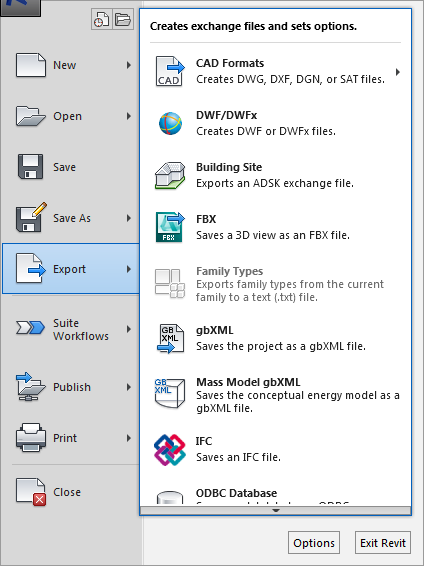

#Exporting FBX
  
We will export out FBX files for a couple of platforms, we can export out to Lumion or 3DS Max both of which are rendering software's. Lumion will accept an FBX or a DAE file we will cover exporting a DAE file in the next section. To do this, you'll need to be in a 3D view and go to file-export-FBX. 
 

