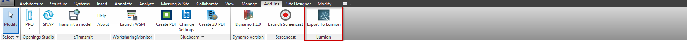

#Exporting to Lumion  
 
So you have a rendering to do and you want something done relatively quick and still looks amazing. You've probably heard the word Lumion thrown around the office quite a bit in the same sentence as rendering. If you haven't heard of Lumion yet, fear not there will be a primer similar to this comming soon. However, if you have heard of lumion and wish to export your Revit model into Lumion it's very simple. You'll need to make sure that you have the add in installed onto your machine. If you don't have it installed just yet you can email <a href="mailto:revitsupport@dpsdesign.org">Revit Support</a> and we can get it taken care of for you. 
 
Now when you have the add in installed you'll need to navigate to the Add-Ins<Export to Lumion (Depending on version for Revit 15 click External Tools drop down<Revit to Lumion Bridge). Before you click export, you want to make sure that your Geometry Accuracy is set to high and if you don't have a need for any interior shots you can check "Skip interior details". 
 

