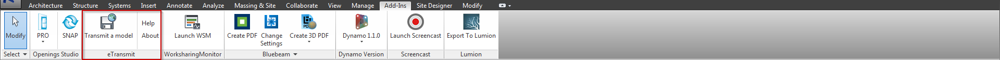
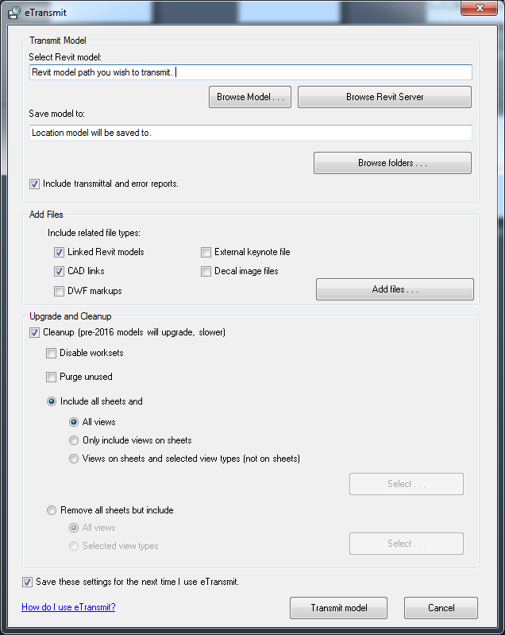

#Transmitting a Model
  
So you're at a pretty good point with your model and you feel comfortable now to send your Revit model to your consultants using Revit. There's a couple of ways to transmit your model to be sent to them, the method we recomend is to use the eTransmit add in. It does a lot of the work for you, which we all love, less work is nice. eTransmit detaches the central for you and saves the detached model in a location of your choosing, it gives you a couple of options to choose from when exporting, so pick them as required. 
 

