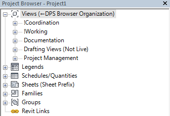

## Managing Views the DPS way

DPS utilizes a folder structure within Revit that is built to reflect the phases of how a project gets developed.

>

* **!Coordination** Views are offered to house coordination workflows. These can be as minimal or as excessive as the individual wants. *Note: exclamation point exists solely to force to top of browser*

* **!Working** Views are offered to support an open creative process. These views can be considered our "messy" views. Everything is turned on and all modeling should occur in this view. (Until reaching documentation phases) *Note: exclamation point exists solely to force to top of browser*

* **Documentation** Views are the views that will be placed on sheets. These views have specific visibility of elements and are considered "clean" views. Modeling should only take place in these views when in the DD or CD phase.

* **Drafting Views (Not Live)** These views are to house details that are not yet on sheets. This includes typical details that you would not complete as a live detail.

* **Project Management** views exist to allow a place for the user to share specific views with a project manager or project architect. This can include views similar to coordination views. *eg: Grid Coordination, Framing vs Plumbing, etc.*
---
### Controlling where a view appears

The method DPS uses to control this browser organization is via **project parameters**. The parameters are assigned to all views within the DPS Revit template.
The two project parameters that are utilized are **Top Tier** and **View Series**. You can see in the image below that they appear under the "text" category. *The reason the top tier is grayed out is because this parameter is typically controlled by the view template. (more on that later)*

> 

###### Top Tier primarily reflects phases of a building or design process. *The reason this parameter was not named phase is to avoid confusion because it can be utilized to include items that are not project phases. (Coordination, LEED, Project Management, etc.)*

* Applicable **Top Tier** types include (but are not limited to):  
  * !Coordination 
  * !Working 
  * Documentation 
  * Drafting Views 
  * Project Management 

###### View Series relates back to National CAD Standards. The numeric portion reflects what sheet the view should appear on.

* Applicable **View Series** types include  (but are not limited to): 
  * AE010 Partition Types  
  * AE100 Floor Plans  
  * AE120 Reflected Ceiling Plans  
  * AE140 Roof Plans  
  * AE201 Exterior Elevations  
  * AE221 Interior Elevations  
  * 360 Casework Sections  
  * 500 Details  
  * 621 Opening Types  
  * 681 Window Types  
  * 900 3D Views  
  * Need to Categorize
